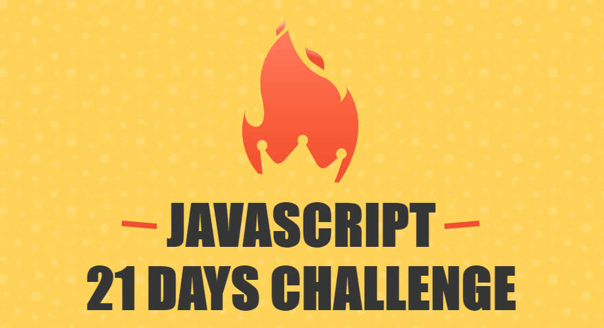

    <h1>21 Days Challenge</h1>
    

# Overview 💻

ภาษา javaScript เป็นภาษาที่ได้รับความนิยมเป็นอย่างมากในการพัฒนาเว็บไซต์และ Apllication ต่างๆ แต่ว่าถ้าหากเราไม่เห็นภาพร่วมหรือว่าความสามารถของภาษา เราก็จะไม่ทราบว่าภาษานั้นสามารถทำอะไรได้บ้าง ใน 21 Day Challenge นี้เราจะได้เรียนรู้ภาพร่วมและความสามารถของภาษา javaScript ว่าทำอะไรได้บ้างโดยที่ไม่พึ่ง Framework, Liberly ใดๆ ทั้งสิ้น โดยเริ่มตั้งแต่ การวิเคราะห์โจทย์ของ workshop การวางโครงสร้างของการเขียนโปรแกรม แนวคิดในการเขียนโปรแกรม ต้องขอขอบคุณพี่บอย วรายุทธ เลิศกัลยาณวัต เป็นอย่างสูงที่ได้ทำโปรเจคดีๆ แบบนี้ออกมาให้ได้เรียนรู้ ขอบคุณมากครับ

> ถ้าหากเราอยากเก่งไม่มีทางลัดอย่างแน่นอน เราจะต้องขยันเรียนรู้ และลงมือทำโปรเจคเยอะๆ เท่านั้น
>> โดย วรายุทธ เลิศกัลยาณวัตร

## Table of contents 🎉

1. [Falling snow]()
2. [Countdown Timer]()
3. [Async/Await]()
4. [Eye Rolling]()
5. [Watercolor Painting]()
6. [Duck Hunt]()
7. [Konami Code]()
8. [What is this]()
9. [Parallax Scrolling]()
10. [Kanban Board]()
11. [Text Reveal]()
12. [Air Quality Visualizer]()
13. [javaScript weird part]()
14. [carousel]()
15. [Music player]()
16. [Text to speech]()
17. [Speech to text]()
18. [What is prototype?]()
19. [Autocomplete]()
20. [Form Validation]()
21. [Infinite Scroll Gallery]()

## Samples Project ⭐⭐⭐⭐⭐

## Credit 21Days challenge
### https://github.com/lvarayut