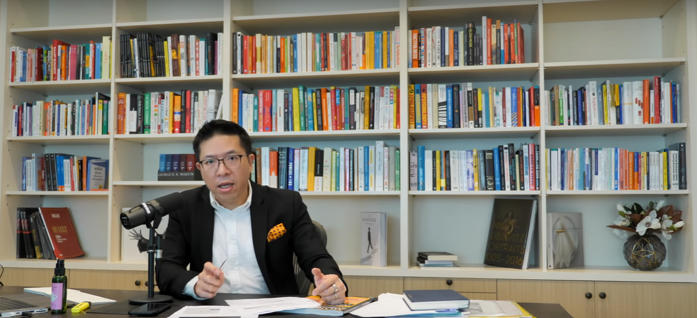

<div align="center">
    <h1>21 Days Challenge</h1>
    
</div>

### Overview

ภาษา javaScript เป็นภาษาที่ได้รับความนิยมเป็นอย่างมากในการพัฒนาเว็บไซต์และ Apllication ต่างๆ แต่ว่าถ้าหากเราไม่เห็นภาพร่วมหรือว่าความสามารถของภาษา เราก็จะไม่ทราบว่าภาษานั้นสามารถทำอะไรได้บ้าง ใน 21 Day Challenge นี้เราจะได้เรียนรู้ภาพร่วมและความสามารถของภาษา javaScript ว่าทำอะไรได้บ้างโดยที่ไม่พึ่ง Framework, Liberly ใดๆ ทั้งสิ้น โดยเริ่มตั้งแต่ การวิเคราะห์โจทย์ของ workshop การวางโครงสร้างของการเขียนโปรแกรม แนวคิดในการเขียนโปรแกรม ต้องขอขอบคุณพี่บอย วรายุทธ เลิศกัลยาณวัต เป็นอย่างสูงที่ได้ทำโปรเจคดีๆ แบบนี้ออกมาให้ได้เรียนรู้ ขอบคุณมากครับ \_/\_

### Content

### [Day 1 Falling Snow](#Day-1-Falling-Snow)

### [Day 2 Countdown Timer](#Day-2-Countdown-Timer)

### Day 1 Falling Snow

สำหรับการเรียนรู้ของโปรเจคนี้ จะเป็นการเรียนรู้เกี่ยวกับ Syntax JavaScript ในหลายตัว สำหรับใช้ในการสร้างโปรเจคจริง ทำให้เห็นภาพมากยิ่งขึ้นว่า ภาษา JavaScipt สามารถทำอะไรได้บ้าง ซึ่งผมคิดว่าเป็นโปรเจคที่ สามารถไปประยุกต์ใช้กับส่วนอื่นๆ ได้อีกจำนวนมาก เช่น

1. Rain
2. Falling star

ซึ่งในส่วนนี้ก็มีสิ่งที่ได้เรียนต่างดังต่อไปนี้


### HTML

```html
<canvas id="falling-snow-canvas"></canvas>
<script src="fallingSnow.js"></script>
```

- เข้าถึง Element canvas ด้วย selector แบบ id
- Element canvas สามารถวาดรูปได้ตามที่เราต้องการ

### CSS

```css
body {
  padding: 0;
  margin: 0;
  background-image: url("Link URL ของรูปภาพที่เราต้องการใช้งาน");
  background-size: cover; /*ขยายรูปภาพให้มีขนาดด้านกว้าง, สูง เต็มหน้าจอของ Browser*/
  background-repeat: no-repeat;
}
```

- background-image //ตั้งค่าภาพพื้นหลังตามที่เราต้องการ
- background-size: cover; //ตั้งค่าให้ภาพพื้นหลังเต็มหน้าจอของ Element นั้นๆ

### javascript

- Function
- Destructuring
- Object Destructuring เช่น const { canvas, canvasContext } = setup();
- spead operator (...)
- ขนาดของ Window
  - window.innerWidth //ความกว้างของหน้า
  - window.innerHeight //ความสูงของหน้าจอ

```js
function setup() {
  const canvas = document.getElementById("falling-snow-canvas");
  canvas.width = window.innerWidth;
  canvas.height = window.innerHeight;

  return {
    canvas,
  };
}
```

- .map()
- .beginPath() เพื่อที่จะบอกโปรแกรมว่า เราจะเริ่มวาด Snowballs Function นี้นะ
- arc(snowBall.x, snowBall.y, 4, 0, Math.PI \*2)  
  Function สำหรับวาดรูปวงกลมโดยมีค่า parameter 5 ตัว ดังต่อไปนี้

1. parameter ตัวที่ 1 รับค่าพิกัด x
2. parameter ตัวที่ 2 รับค่าพิกัด y
3. parameter ตัวที่ 3 ขนาดของรูปวงกลม
4. parameter ตัวที่ 4 องศาเริ่มต้น
5. parameter ตัวที่ 5 องศาสิ้นสุด (Math.PI \* 2 เพื่อที่จะให้เป็นวงกลม)

- .getContext('2d') //2d เป็นเซ็ตค่าสำหรับทั่วไป 3d เป็นการเซ็ตค่าแบบ 3 มิติ หรือว่าแบบเกมส์
- .floor(คือการปัดเศษให้เป็นจำนวนเต็ม)
- .forEach()
- setInterval คือการเซตเวลาของโปรแกรมให้เป็นไปตามระยะเวลาที่เรากำหนด
- condition

```javaScript
  // move
  function moveSnowBall(canvas, snowBall) {
    snowBall.x += snowBall.speedX;
    snowBall.y += snowBall.speedY;

    //condition
    if(snowBall.x > canvas.width) {
      snowBall.x = 0;
    } else if ( snowBall.x < 0 ) {
      snowBall.x = canvas.width
    }

    if ( snowBall.y > canvas.height ) {
      snowBall.y = 0;
    }
  }
```

## Day 2 Countdown Timer

Countdown Timer เป็นโปรเจคที่ทำเกี่ยวกับการนับถอยหลัง โดยโปรเจคนี้จะยิ่งเห็นภาพมากยิ่งขึ้นว่า javaScript สามารถทำอะไรได้บ้าง ไม่ว่าจะเป็นการคำนวณ การทำ Dynamic Effects ที่สำคัญยังได้เรียนรู้ การเขียนโปรแกรมยังเป็นขั้นตอนอีกด้วย ทั้งการวางโครงสร้างของการเขียนโแกรม ถือว่าสำคัญมากสำหรับการเรียนรู้ สำหรับการประยุกต์ใช้ก็คือ

- สร้าง CountDownt timer Project
- สร้าง Countdownt ว่าตั้งแต่วันที่กำหนดในอดีต มาถึงวันนี้ใช้เวลามาแล้วทั้งหมดกี่วัน

### CSS

### javaScript

.getTime()
Date()


